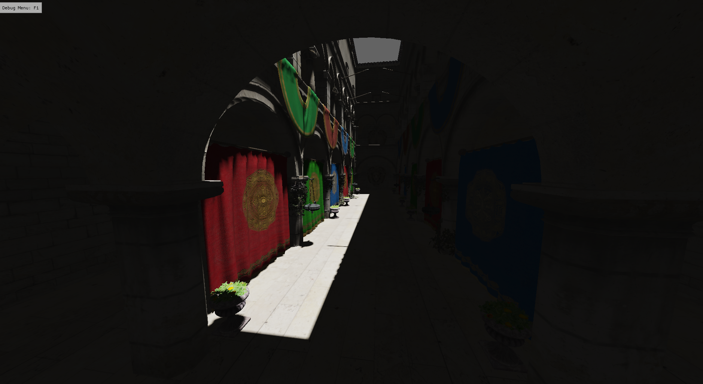
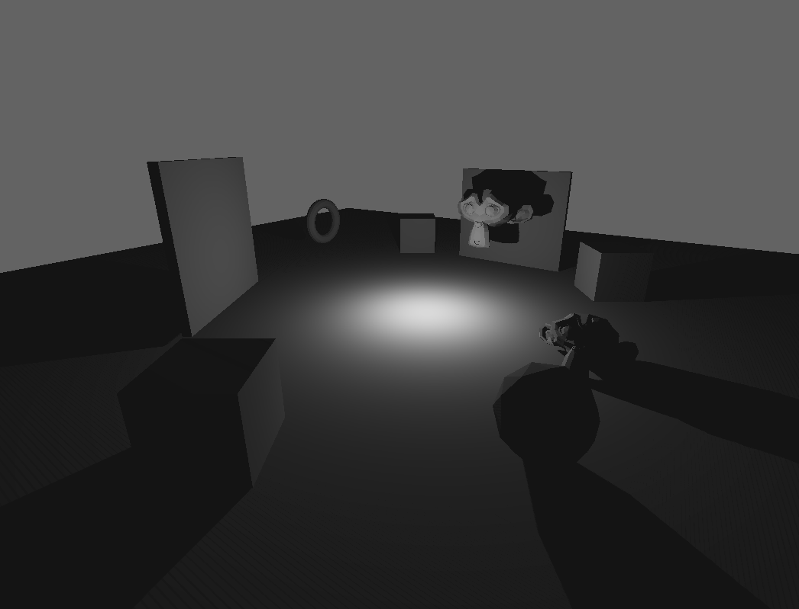
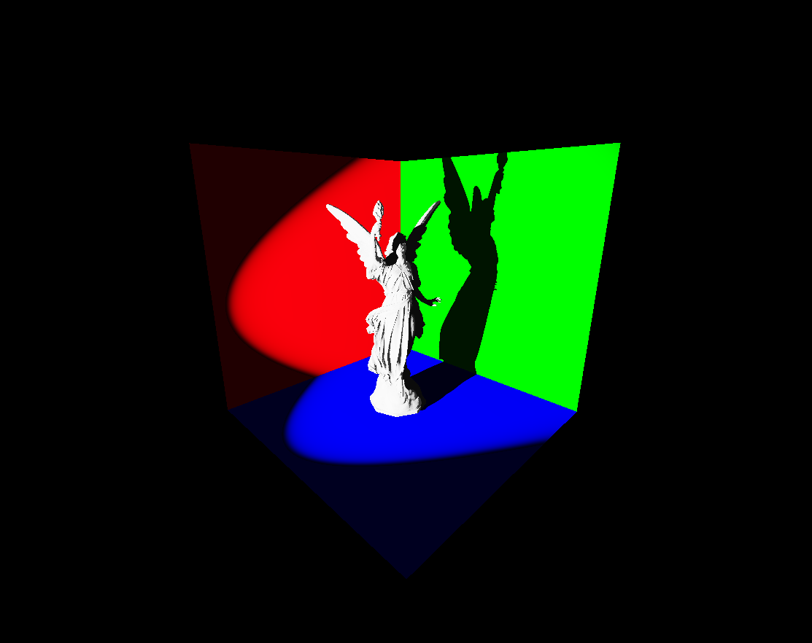
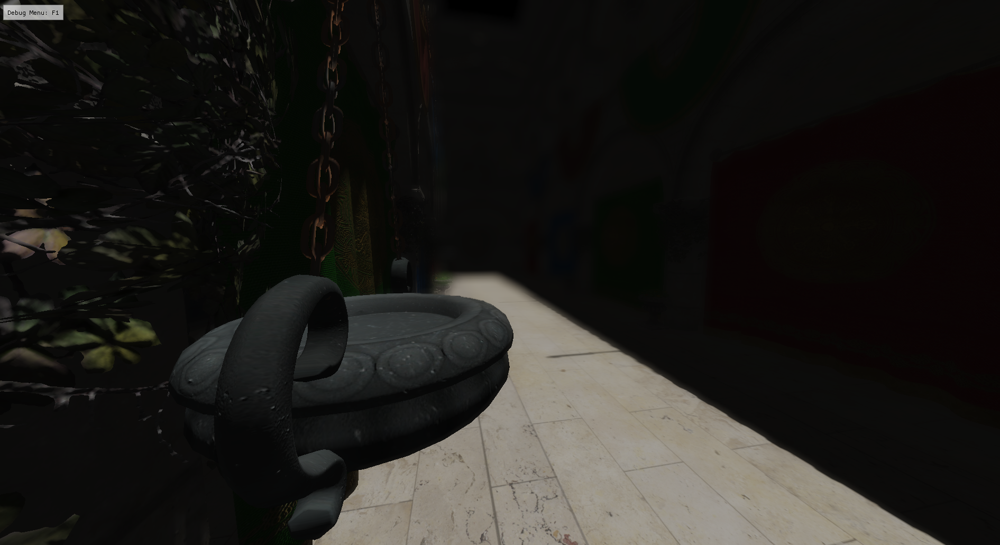

# Beached : a DirectX 12 renderer

Work in progress

## Current features

### Renderer
- Shadows: Cascaded (Directional Lights), Omnidirectional (Point Lights), Directional (Spot Lights)
- PostFX: Bokeh Depth of Field

### Engine
- CPU side frustum culling
- Asset caching for shaders and textures
- Deserialization of render pass resources from a TOML file

## WIP
- Auto-Exposure

## Roadmap

### Planned
- **PostFX**: Motion Blur, SSAO, Bloom, TAA, Color Grading, Pixel Sorting
- **GPU Driven**: Draw Indirect, Clustered Forward, Occlusion culling
- **Raytracing**: Soft Shadows, Reflections, Ambient Occlusion, Global Illumination
- **Light Transport**: Reference pathtracer, PBR, reflective shadow maps
- **GPU Compute**: Particles, Ocean, Terrain
- **Volumetrics**: God rays, clouds, fog
- **Engine**: Multithreadng, DirectStorage, Upscaling, Physics, Audio, Hot Reloading

## Screenshots

### Shadows

| CSM         | Point       | Spot |
| ----------- | ----------- | ---- |
|  |  |  |

### Post Processing

| Bokeh DOF   |
| ----------- |
|  |
